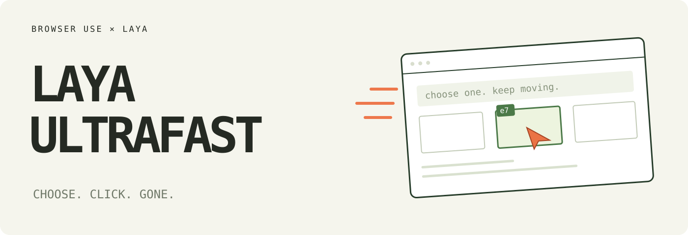

# Laya Browser Ultrafast ⚡

**A browser agent with a dynamic, indexed action space.**

Give it one goal. A local [Laya](https://github.com/NandhaKishorM/laya) System-1 decision model (`pip install laya`) picks an operation and an element in one forward pass. A small LLM writes text only when the operation is `TYPE_TEXT`. The hosted TypeSafe Jev API remains as a legacy backend (`DECISION_BACKEND=typesafe`).

**Zürich → London on Google Flights in 7.1 seconds (upstream Jev recording).** One natural-language goal, actual text generation, and loading waits included. Laya timings will be re-measured; the loop is unchanged.

<a href="docs/demo.mp4"></a>

[Watch the MP4](docs/demo.mp4) · [Measurements](docs/performance.md) · [Read the loop](laya_browser_ultrafast/agent.py)

Derived from [browser-use/jev-ultrafast](https://github.com/browser-use/jev-ultrafast) (MIT). Decision model swapped to open-weights [Laya](https://github.com/NandhaKishorM/laya) (Apache-2.0) via `pip install laya`. Original Jev docs and measurements are kept as upstream evidence.

## The action space

Every observation produces a new element table:

```text
[1] button    Change ticket type · Round trip
[2] combobox  Where from?        · San Francisco
[3] combobox  Where to?          · empty
[4] textbox   Departure          · empty
...
```

The operations are `CLICK`, `TYPE_TEXT`, `SELECT`, `SCROLL_UP`, `SCROLL_DOWN`, `WAIT`, `DONE`, and `BLOCKED`. Only supported operations and targets are offered.

```text
                       one decision request
                      ┌───────────────────────────┐
page → element table → operation                 │
                      │ click_target              │
                      │ type_text_target          │
                      │ select_target, if present │
                      └─────────────┬─────────────┘
                          use the matching target
                                    │
                     CLICK [7] ─────┤──→ browser
                 TYPE_TEXT [3] ─────┘
                           ↓
                    small LLM → text → browser
```

Target questions are speculative. If the operation is `CLICK`, only `click_target` can execute. Two decisions, **one forward pass**. Each target head contains only compatible elements. Native dropdown choices carry an observed element/option index.

There are no site-specific action scripts or prepared field strings in the policy. The Flights example supplies a goal and independently verifies the outcome. The screenshot renderer adds labels afterward; it does not drive the browser.

## Try it

```bash
git clone https://github.com/Duc-python/laya-browser-ultrafast.git
cd laya-browser-ultrafast
uv sync
cp .env.example .env
# Laya local needs no API key for decisions. Add TEXT_MODEL_API_KEY.
# Optional: LAYA_MODEL=cklxx/laya-browser for browser-tuned weights.
uv run laya-browser
```

Open **http://127.0.0.1:8766** and click **Start demo → Run automatically**. The inspector shows numbered elements, operation probabilities, target probabilities, and executed actions. **Choose next** pauses before execution.

Chrome connects through [Browser Harness](https://github.com/browser-use/browser-harness), installed by `uv sync`. Run `uv run browser-harness --doctor` if it needs connecting. Allow remote debugging in Chrome when prompted.

`TEXT_MODEL_API_KEY` is an OpenRouter key in the example configuration. The current demo uses `inception/mercury-2.5` with reasoning disabled. Gemini, GLM, and DeepSeek can also use the OpenAI-compatible text helper; configure the appropriate model, endpoint, and reasoning setting.

### Decision backends

```bash
# Default: local Laya (no decision API key)
DECISION_BACKEND=laya
# Optional tuning for dense pages:
LAYA_HEAD_MAX_LEN=768
LAYA_MAX_LEN=2048
# LAYA_MODEL=cklxx/laya-browser  # browser-tuned checkpoint

# Legacy: hosted Jev API (needs TYPESAFE_API_KEY)
DECISION_BACKEND=typesafe
# Or point TYPESAFE_BASE_URL at a local shim:
# `laya-serve` (pip install "laya[serve]") or laya2typesafeapi on :8100
TYPESAFE_BASE_URL=http://127.0.0.1:8000
```

## Use the library

```python
from laya_browser_ultrafast import Agent

with Agent(
    "https://www.google.com/travel/flights?hl=en",
    "Find one-way flights from Zurich to London on September 20, 2026, "
    "for one adult in economy. Stop when matching flight options are visible.",
) as agent:
    for state in agent.run():
        print(state["elapsed_ms"], state["status"])
```

Run with `uv run --env-file .env python your_script.py`. The same policy can run a different task:

```bash
uv run --env-file .env python examples/run.py \
  --url https://en.wikipedia.org/wiki/Main_Page \
  --goal 'Find and open the Wikipedia article about Gödel’s incompleteness theorems.'
```

`uv run --env-file .env python examples/flights.py --keep-open` performs the flight search, checks the actual route/date/results, and saves its trace. It does not select or book a flight.

## Why it moves

- **One request per decision cycle.** Operation and target heads share the same observed state.
- **No screenshots in the default agent loop.** Laya consumes structured state. The inspector opts into screenshots; the video uses a separate continuous screencast.
- **One browser call per snapshot.** Read visible controls, their names, values, and text atomically. Keep references to the actual DOM nodes.
- **Validate the selected target.** Clicks check the document, form values, target, and nearby context. Animation alone does not force another prediction. Resolve current geometry and reject covered controls before input.
- **Wait for useful state.** After typing into a combobox, wait for visible suggestions, capped at 200 ms. Other interactions get at most two animation frames or 50 ms. These reads happen after execution is logged.
- **Keep hidden tabs rendering.** Focus emulation prevents background animation throttling without switching Chrome's visible tab.
- **Send visible text.** Offscreen article bodies and footers do not fill the model context.
- **Reuse an interrupted text request.** A generated value survives a stale-page retry only if the entire text-helper input is unchanged.

Every executed target is resolved from an observed node. The executor rechecks page freshness and click occlusion. Model output never becomes selectors, coordinates, shell commands, or executable JavaScript. Text-helper output must parse as a small JSON object before typing.

## Small enough to read

| File | Job |
| --- | --- |
| [agent.py](laya_browser_ultrafast/agent.py) | The complete loop and text-helper handoff |
| [snapshot.js](laya_browser_ultrafast/snapshot.js) | Atomic DOM snapshot, indexed controls, freshness guards |
| [browser.py](laya_browser_ultrafast/browser.py) | Browser connection, current geometry, execution |
| [model.py](laya_browser_ultrafast/model.py) | Decision backend (Laya local / TypeSafe legacy), operation/target heads, text generation |
| [questions.py](laya_browser_ultrafast/questions.py) | Model instructions |
| [demo.py](laya_browser_ultrafast/demo.py) | Local inspector |

## Evidence and limits

The current video is the upstream **7,073 ms** Google Flights run (Jev). Timing starts after initial page observation and includes model calls, generated text, browser work, stale decisions, and loading waits. A fresh independent check verifies the one-way setting, Zürich, London, September 20, 2026, and visible flight options. The video plays at 1×, with no opening hold and a 0.5-second final hold.

In six alternating upstream runs with identical models and settings, both versions passed **3/3**. Median task time went from **9.450 s → 7.092 s**, a **25% reduction**; median browser protocol calls went from **1,092 → 101**. This is three repeats of one task on one browser profile, not a general reliability benchmark. Laya runs must be measured separately; stock Laya trails Jev on browser targeting until fine-tuned (see `cklxx/laya-browser`: element top-1 0.10 → 0.66).

The same policy opened the requested Wikipedia article in **2.798 s** and passed a local hotel search/filter task in **1.896 s** (upstream). Runs, failures, source hashes, and measurement boundaries are in [performance.md](docs/performance.md).

A `DONE` choice still requires independent outcome verification. The DOM reader handles common HTML and ARIA controls, not the full accessible-name specification. Shadow roots, frames, canvas, uploads, pop-up tabs, nested scrolling, and arbitrary keyboard widgets remain outside this MVP. Owned tabs share the existing Chrome profile.

Laya caveat: browser target heads are high-cardinality. Raise `LAYA_HEAD_MAX_LEN=768` / `LAYA_MAX_LEN=2048` for dense pages (encoders support up to 8192). Very long element lists still favor coarse-to-fine or shortlisting.

## Development

```bash
uv run ruff check .
uv run pytest
node --check laya_browser_ultrafast/static/app.js
node --check laya_browser_ultrafast/snapshot.js
uv build
```

Tests are offline. `uv run python scripts/check_guards.py` checks real controls in a local browser without model calls. Live examples and recording scripts make paid API calls. `scripts/record_flights.py <new-folder>` captures original browser timestamps; `scripts/render_demo.py <recording-folder>` renders that verified run at 1× and crops out the Google account strip. Credentials and raw traces stay ignored.

---

[Browser Use](https://github.com/browser-use/browser-use) · [Browser Harness](https://github.com/browser-use/browser-harness) · [Laya](https://github.com/NandhaKishorM/laya) · [TypeSafe speculative fan-out](https://docs.typesafe.ai/patterns/fan-out)
